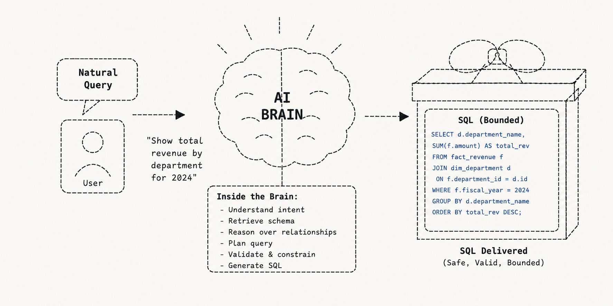

# Querent

<p align="center">
  
</p>

<p align="center">
  <strong>Natural Language → SQL platform with hybrid RAG, schema reasoning,
  and constrained generation for complex relational databases.</strong>
</p>

## What it does

Takes natural language questions about a relational database and generates
validated, executable SQL. Built for complex enterprise schemas (62+ tables,
150+ foreign keys).

## Architecture

```
Natural Language Query
        │
        ▼
Query Understanding (Intent + Entity + Table Mapping)
        │
        ▼
Hybrid Retrieval Layer (Vector + BM25 + FK Graph → RRF → Cross-Encoder Rerank)
        │
        ▼
Context Assembly (Schema + Joins + Glossary + Examples)
        │
        ▼
LLM Inference (SQL Generation)
        │
        ▼
Validation Pipeline (Syntax → Schema → Safety → Semantic)
        │
        ├── Pass → Execution → Results
        │
        └── Fail → Repair Loop → Re-validation
```

## Design Principles

- **Schema-first reasoning** — retrieval grounded in actual relational structure
- **Deterministic validation** — no execution without AST-level safety checks
- **Provider-agnostic inference** — runs fully local by default (llama.cpp / GGUF);
  also supports external public LLM providers — Mistral, Google Gemini, and
  DeepSeek — behind the same interface via one config flag, no code change
- **Graph-aware retrieval** — join paths derived from FK relationships
- **Failure-driven improvement** — production errors structured for training reuse

## Why This System is Different

| Capability | Description |
|---|---|
| Graph-aware retrieval | Uses FK graph traversal to identify valid join paths |
| Multi-source context fusion | Combines vector search, keyword search, and schema graph signals via RRF, then cross-encoder reranking |
| AST-based validation | Enforces SQL correctness beyond regex or heuristic checks |
| Controlled execution gate | Prevents unsafe or invalid SQL from reaching the database |
| Repair loop | Iteratively corrects recoverable SQL failures |
| Pluggable LLM backend | One provider interface serves local llama.cpp or an external public provider (Mistral, Google Gemini, DeepSeek) — swap via config, not code |
| Local specialisation | Optional LoRA fine-tuning adapts a local model to the target schema without modifying base model weights |

## Technology Stack

- Python 3.11
- PostgreSQL-compatible databases
- LLM inference — local (llama.cpp / GGUF) or external public providers (Mistral, Google Gemini, DeepSeek), behind a common provider interface
- Vector search (Qdrant)
- Keyword search (OpenSearch)
- Cross-encoder reranking (sentence-transformers)
- SQL AST parsing (sqlglot)
- Parameter-efficient fine-tuning (PEFT / LoRA, TRL)
- Structured logging (structlog)

## Repository Structure

```
pipeline/      Orchestration and execution flow
retrieval/     Hybrid retrieval (vector + keyword + graph), RRF fusion, reranking
generation/    Prompting, query understanding, LLM inference
               └── llm/        Provider abstraction — local llama.cpp, Mistral, Gemini, DeepSeek
validation/    AST-based SQL validation and repair
               ├── ast/        Syntax-level checks
               ├── schema/     Table / column / type validation
               ├── semantic/   Logical and semantic audits
               └── security/   Safety and execution-gate checks
indexing/      Schema indexing pipelines
ingestion/     Schema and metadata ingestion
fine_tuning/   Optional local LoRA fine-tuning (data prep, trainer, export)
config/        Runtime configuration
tests/         System validation tests
```

## Setup

```bash
git clone https://github.com/francis-ouseph-k/querent.git
cd querent
pip install -r requirements.txt

# Optional — only needed for an external public LLM provider (Mistral / Gemini / DeepSeek)
pip install -r requirements_llm_providers.txt

# Optional — only needed for local LoRA fine-tuning
pip install -r requirements_fine_tuning.txt

# Configure your database connection and LLM provider in .env
# (see .env.example)
python main.py
```

## Example

**Input:** "What is the total marks scored by students in Physics in the 2024 odd semester?"

**Output:**
```sql
SELECT SUM(marks_obtained) 
FROM student_marks sm 
JOIN subjects s ON sm.subject_id = s.id 
WHERE s.name = 'Physics' 
  AND sm.academic_year = 2024 
  AND sm.semester_type = 'odd';
```

**Validation:** PASSED (12/12 checks)

## Evaluation

Tested against a 62-table PostgreSQL schema with 150+ foreign keys, using a
191-question benchmark spanning lookup, aggregation, hierarchy, and
multi-join reasoning.

| Metric | Result |
|---|---|
| Execution success | 182 / 191 (95.3%) |
| Offline test suite | 287 passing |
| Correction-loop recovery | 86% semantic, 50% schema |

The nine remaining failures are mostly the pipeline working as designed:
three are correct refusals (the question explicitly requests a column that
policy forbids returning), two are correct rejections of SQL that contradicts
the schema's own seed data, and the rest are genuine model errors caught
before execution.

Execution success is reported as what it is — *the SQL ran* — not as a
correctness claim. Every `Success` row was additionally audited by hand
against the NL intent and the DDL; see **Known Limitations** below for what
that audit can and cannot establish.

## Status

Complete end-to-end NL → SQL pipeline with retrieval, generation, validation,
and execution layers. Development is closed at a verified state; the
architecture is stable and the remaining work is verification against real
data rather than accuracy tuning.

## Known Limitations

Open, understood, and documented rather than silently carried:

1. **No representative production data.** The database holds only the DDL's
   seed rows — the largest result across 182 successful queries was 7 rows,
   and 66 returned zero. A zero-row result is indistinguishable from a
   silently-wrong query, and defect classes needing volume (join fan-out,
   NULL propagation, row multiplication) cannot surface at this scale. The
   `EXPLAIN` cost gate is likewise calibrated against empty tables and will
   need recalibrating once data is loaded. **This gates everything else.**
2. **Superlative direction.** "Oldest"/"newest" is not mapped onto
   `MIN`/`MAX`; one benchmark query computes the age of the newest row where
   the oldest was asked for. Fixing this deterministically would require
   per-expression special-casing that the codebase deliberately avoids.
3. **Unprompted model-added filters.** The model occasionally narrows a query
   beyond the question — e.g. adding `is_active = TRUE` to an "average
   duration" question, excluding completed records. Caught only where the
   filtered value comes from a `CHECK`-constrained vocabulary.
4. **L7 output-coverage false positives.** The requested-column extractor
   matches noun phrases and misses correctly-projected columns with differently
   worded aliases. Advisory only — never gates a retry — but it applies a
   confidence penalty that *understates* quality on correct queries.
5. **Missing `data/academic_unit_codes.json`.** Where `ingest.py` has not been
   run, course-code fuzzy matching is disabled and entity resolution falls back
   to `ILIKE` on free-text columns, so a code-like token can match a name
   column instead of a code column. Environment setup, not a code defect.

Full detail, including the reasoning behind each decision not to patch, is in
`readme/README.md` → **Known Limitations — Verified State**.

Developed over 40+ commits across schema ingestion, retrieval pipelines, 
reasoning engines, and validation layers. Architecture iterated through 
multiple RAG and fine-tuning experiments before converging on the current 
hybrid approach.

## Background

Built as an independent architecture exercise to validate hybrid RAG and 
constrained generation approaches for enterprise NL→SQL, following production 
experience architecting similar systems in higher education.

## Contact

- LinkedIn: [linkedin.com/in/francis-ouseph-k](https://linkedin.com/in/francis-ouseph-k)
- Email: francis.ouseph.k [at] gmail [dot] com

## License

MIT License. See `LICENSE` for details.
